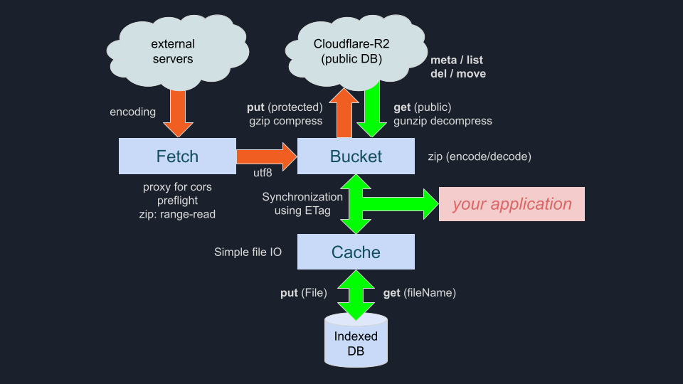

# 📦 nativeBucket.js

> **The Zero-Latency Bridge for Heavy Data.** > Stop waiting for downloads. Start interacting with 1GB+ datasets in milliseconds.

[](https://opensource.org/licenses/MIT)
[](https://workers.cloudflare.com/)
[](https://vitejs.dev/)

---

## ⚡ The Problem: The "1GB+ Wall"
Traditional web apps struggle with large archives like GIS data:
- **CORS Restrictions**: Remote servers block your `fetch`.
- **Memory Crashes**: Downloading a 1GB+ ZIP crashes mobile browsers.
- **Latency**: Repeatedly downloading the same heavy file kills UX.

**nativeBucket.js** solves this by orchestrating **Cloudflare R2**, **Edge Proxies**, and **IndexedDB** into a single, high-performance workflow.

## 🏗 System Architecture


## 🚀 [Live Demo (Performance Story)](https://kenjiyoshidahome2026-bit.github.io/native-bucket/demo/)

Experience the full lifecycle of data, from a locked remote server to a functional local object.

1. **The Bypass**: Seamlessly route through a **Cloudflare Proxy** to defeat CORS.
2. **Smart Extraction**: Don't download the whole ZIP. We map the remote archive and extract **only the specific file** you need on-the-fly.
3. **Edge Sync**: Push the extracted file to **Cloudflare R2** with automatic **Gzip** and **Multipart Upload** (>5MB).
4. **Persistent Cache**: Store the result in **IndexedDB**.

## 🚀 Get Started in 5 Minutes

### 1. Setup Your Storage (Server-Side)
`nativeBucket.js` empowers you to own your data.
1. **Create an R2 Bucket** in your Cloudflare dashboard (e.g., `my-storage`).
2. **Deploy the Worker**:
   ```bash
   cd workers
   # Update wrangler.toml with your bucket name
   npx wrangler deploy
   ```

### 2. Initialize the Library (Client-Side)
```javascript
import nativeBucket from './dist/native-bucket.iife.js';
 - or -
<script src="https://cdn.jsdelivr.net/gh/kenjiyoshidahome2026-bit/native-bucket@main/dist/native-bucket.iife.js"></script>

const { Fetch, Bucket, Cache } = nativeBucket("https://your-api.workers.dev");
```
## 🛠 API Reference

### 🌐 `Fetch(url, options)`
The "CORS-Killer". Fetches and extracts data from anywhere.
- `type`: Output format (`"file"`, `"json"`, `"blob"`, etc.).
- `target`: Filename to extract if the source is a ZIP.
  ( if target == false, outputs fileList )
- `encoding`: utf8 / shift-jis etc.[utf8]
- `event`: eventTerget [winndow|self]

### 🪣 `Bucket(directory)`
Your personal file system on the R2 Edge.
- `get(name[,type])`: Fast retrieval from R2.
- `meta(name)` : get meta data of the file (fast).
- `put(file)`: Parallel upload with auto-compression.
- `del(name)` : Delete a file in R2.
- `move(name, newName)` : Rename a file in R2.
- `list()` : entire file list
- `gets(zipName, target)`: Extract specific files from a ZIP stored in R2.
- `puts(zipName, files)`: Extract specific files from a ZIP stored in R2.

### ⚡ `Cache(name)`
The "Zero-Latency" simple engine using IndexedDB.
```javascript
const gisCache = await Cache("map/layers"); // dbname/tablename
await gisCache(myFile); // Save
const file = await gisCache("japan.geojson"); // Get
const geojson = JSON.parse(await file.text());
```

## 📦 Quick Start (CDN)

Simply include the library via a single script tag in your HTML:

```html
<script src="https://api.ortho-earth.com/native-bucket.js"></script>
<script>
  // Initialize with your custom API endpoints
  const { Fetch, Bucket, Cache } = nativeBucket([your worker address]);

  // Example: List files from a bucket
  const myBucket = new Bucket("my-folder");
  myBucket.list().then(console.log);
</script>
```
## 📄 License

(c) 2026 Kenji Yoshida. Released under the **MIT License**.